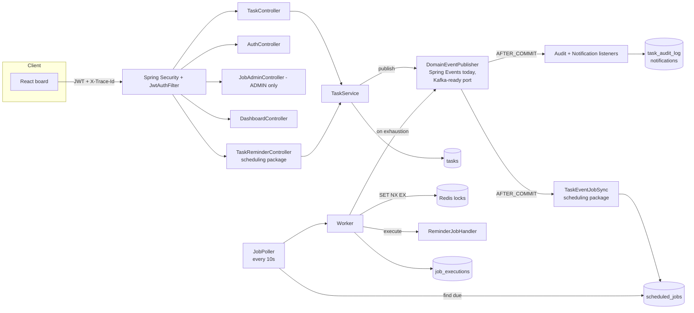
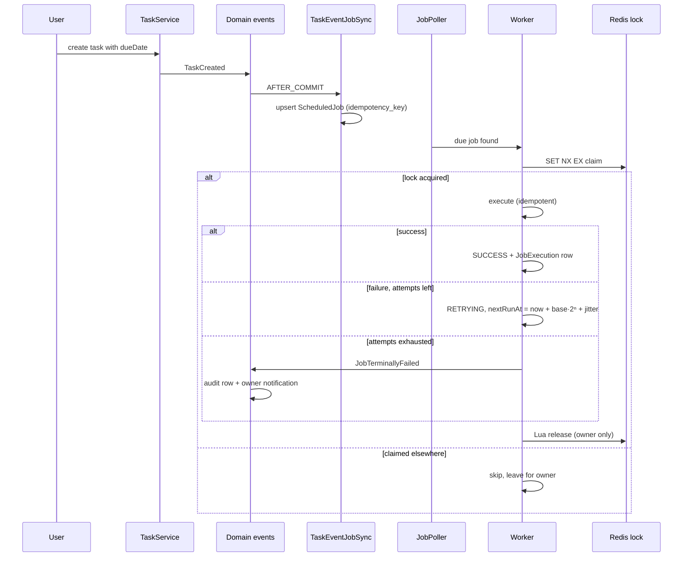
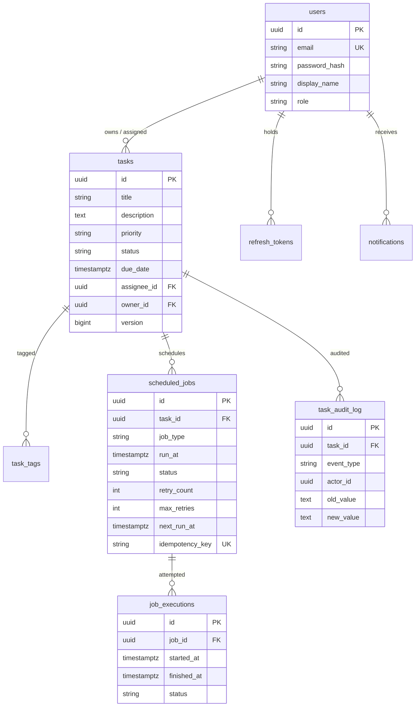

# TaskFlow

**Every due date is a promise the system keeps.**

[](https://openjdk.org/projects/jdk/21/)
[](https://spring.io/projects/spring-boot)
[](https://www.postgresql.org/)
[](https://redis.io/)
[](https://react.dev/)
[](https://www.typescriptlang.org/)
[](https://www.docker.com/)
[](./backend/src/test)
[](https://youtu.be/VDOKjDDerXg)

**Demo:** [watch the walkthrough on YouTube](https://youtu.be/VDOKjDDerXg) —
login → board → drag → detail panel with reminder status → overview → jobs → dark mode.

## Table of Contents

- [Overview](#overview)
- [System Architecture](#system-architecture)
- [Job Lifecycle](#job-lifecycle)
- [Features](#features)
- [API Reference](#api-reference)
- [Database Schema](#database-schema)
- [Tech Stack](#tech-stack)
- [Known Limitations](#known-limitations)
- [UI Preview](#ui-preview)
- [Getting Started](#getting-started)
- [👤 Author](#-author)

## Overview

TaskFlow looks like a minimal Trello/Linear board (Backlog / In Progress / Done) but is built
like infrastructure: every task with a due date becomes a **ScheduledJob** processed by
background **Workers** with Redis distributed locking, exponential-backoff retry, idempotency,
and optimistic concurrency — communicating only through **domain events**.

### Design decisions that go beyond a typical CRUD API

| Challenge | How it's solved |
|---|---|
| Two workers must never run the same job twice | Redis `SET NX EX` claim with owner token + Lua compare-and-del release; fail-closed (no lock → skip). Proven by `DualWorkerIT`: two real threads, real Redis, exactly one `SUCCESS` execution |
| A failing reminder must retry, then give up loudly | Exponential backoff (`base·2ⁿ` + jitter, 5 attempts default) → `PERMANENTLY_FAILED` + `JobTerminallyFailed` event → audit row + owner notification |
| Duplicate dispatches must not double-execute | `idempotency_key` UNIQUE constraint in Postgres (DB-level, not just a code check) + runnable-state guard in the Worker |
| Two users editing the same card must not lose edits | `@Version` optimistic locking; every `TaskResponse` carries `version`; stale writes get HTTP 409 `VERSION_CONFLICT`, covered by `TaskConflictIT` |
| Scheduling must not tangle with task logic | `scheduling` package never imports `task` — it only observes `TaskCreated`/`TaskUpdated` domain events (`AFTER_COMMIT`) and upserts jobs |
| Every state change must be explainable | `TaskStatusChanged`/`TaskAssigned`/… events → audit log rows + notification rows + activity feed, all visible in the UI |
| Auth must survive token theft windows | Short-lived JWT access (15 min) + rotating refresh tokens (SHA-256 hashed at rest, single-use) |
| Debugging async work must be traceable | Correlation id per request (`X-Trace-Id`), propagated into worker MDC logs (`[job-96fa6ea8] … succeeded`) |

## System Architecture



## Job Lifecycle



## Features

**Auth & Security** — register/login/refresh rotation; JWT access + refresh; RBAC
(OWNER / ASSIGNEE / ADMIN, first account bootstraps admin); per-user task isolation;
consistent `{code, message, traceId, fieldErrors}` error shape.

**Task Management** — CRUD, drag-and-drop `PATCH /status` with version, filters
(status, assignee, tag, overdue, search), priority dots, fully editable tags, due dates
(set + clear), per-task **reminder box** showing the live ScheduledJob state (status,
attempts, next run, last error), audit timeline per task, keyboard shortcuts
(`/` search, `N` new task, `Ctrl+S` save, `esc` close).

**Scheduling & Reliability** — due-date → job generation; single-flight poller; Redis-locked
workers; backoff retry; terminal-failure events; per-attempt execution log; manual admin retry.

**Notifications** — bell with unread count (30s poll), mark-all-read, event-driven
(status changes, assignments, failed reminders).

**Observability** — structured logs with trace ids, Swagger UI (`/swagger-ui.html`),
dashboard summary (counts, overdue, recent activity), admin jobs view.

## API Reference

Base: `/api/v1`. Full list with schemas: `/swagger-ui.html` when the app runs.

| Method | Path | Who | Description |
|---|---|---|---|
| POST | `/auth/register` | public | Register (first account becomes ADMIN) |
| POST | `/auth/login` | public | Login |
| POST | `/auth/refresh` | public | Rotate refresh token |
| GET | `/auth/me` | user | Current user |
| POST | `/tasks` | user | Create task (dueDate auto-schedules a job) |
| GET | `/tasks?status=&assigneeId=&tag=&overdue=&search=` | user | Filtered list (always includes `version`) |
| GET | `/tasks/{id}` | owner/assignee/admin | Task detail |
| PUT | `/tasks/{id}` | owner/assignee/admin | Full edit (requires `version`, 409 on stale; `clearDueDate: true` clears the due date) |
| PATCH | `/tasks/{id}/status` | owner/assignee/admin | Drag-and-drop move (requires `version`) |
| DELETE | `/tasks/{id}` | owner/assignee/admin | Delete |
| GET | `/tasks/{id}/history` | owner/assignee/admin | Audit timeline |
| GET | `/tasks/{id}/reminder` | owner/assignee/admin | Live reminder state: scheduled job status, attempts, next run, last attempt |
| GET | `/jobs?status=` | admin | Scheduled jobs |
| GET | `/jobs/{id}/executions` | admin | Run attempts |
| POST | `/jobs/{id}/retry` | admin | Re-queue a failed job |
| GET | `/dashboard/summary` | user | Counts, overdue, recent activity |
| GET | `/notifications` | user | Notification feed |
| GET | `/notifications/unread-count` | user | Unread badge |
| POST | `/notifications/read-all` | user | Mark all read |

<details>
<summary>Sample: create task (request → response)</summary>

```json
// POST /api/v1/tasks
{ "title": "Ship invoices", "priority": "HIGH",
  "dueDate": "2026-09-28T09:00:00Z", "tags": ["billing"] }
```

```json
// 201 Created
{ "id": "6c9a0b8a-b814-4ba8-b9f4-8c1f5882af39",
  "title": "Ship invoices", "description": null,
  "priority": "HIGH", "status": "TODO",
  "dueDate": "2026-09-28T09:00:00Z", "tags": ["billing"],
  "assigneeId": null, "ownerId": "…", "version": 0,
  "createdAt": "…", "updatedAt": "…" }
```

</details>

<details>
<summary>Sample: stale write (409)</summary>

```json
// PUT /api/v1/tasks/{id} with an outdated version → 409 Conflict
{ "code": "VERSION_CONFLICT",
  "message": "Someone else edited this task. Reloaded the latest version — please retry.",
  "traceId": "a3f9c1e2", "timestamp": "…", "fieldErrors": null }
```

</details>

## Database Schema



## Tech Stack

| Layer | Technology |
|---|---|
| Language / framework | Java 21, Spring Boot 3.2.5 (web, security, data-jpa, validation, data-redis) |
| Database / migrations | PostgreSQL 16, Flyway |
| Coordination / cache | Redis 7 (distributed locks via `SET NX EX` + Lua release) |
| Auth | Spring Security, JJWT 0.12.5 (access + rotating refresh) |
| Events | Spring application events behind a `DomainEventPublisher` port (Kafka-ready) |
| API docs | springdoc-openapi (Swagger UI) |
| Tests | JUnit 5, Mockito, AssertJ, Testcontainers 1.20.4, MockMvc (7 unit + 4 integration via `mvn verify` + failsafe) |
| Frontend | React 18, TypeScript 5, Vite, react-router, dnd-kit |
| Ops | Multi-stage Dockerfile, docker-compose (app + postgres + redis) |

> **Declared but not currently wired:** `com.h2database:h2` sits on the runtime classpath
> but no profile uses it — the app requires PostgreSQL (Flyway `validate` + Postgres
> SQL). It is kept only as a reminder to add a zero-dependency dev profile later, and
> claiming otherwise would be dishonest. Everything else in `pom.xml` is exercised by
> code or tests (including `spring-boot-starter-aop`, which backs `@Async`/`@Transactional`).

## Known Limitations

| Limitation | Status |
|---|---|
| Reminder "delivery" is logged + recorded, not emailed/SMSed | By design for now; `JobHandler` is the seam for a real sender |
| No rate limiting yet | Planned (Redis Lua per-IP, same pattern as sibling projects) |
| CORS allows only `http://localhost:5173` | Fine for local dev, must be externalized for deploy |
| Board cache-aside in Redis was designed but not yet wired | The lock path uses Redis; query caching is still TODO |
| Testcontainers ↔ Docker Desktop 29 handshake fails on Windows (docker-java HTTP 400) | Workaround built in: tests run unmodified against compose infra via `TASKFLOW_PG_URL`/`TASKFLOW_REDIS_*` env override; Testcontainers remains the default path |
| Single-instance poller (single-flight, not leader-elected) | Safe with N workers thanks to locking, but polling itself isn't HA |

## UI Preview

Video walkthrough: [youtube.com/watch?v=VDOKjDDerXg](https://youtu.be/VDOKjDDerXg).

<!-- SCREENSHOT SLOT: board light mode -->
<!-- SCREENSHOT SLOT: board dark mode -->
<!-- SCREENSHOT SLOT: task detail slide-over with reminder box + audit timeline -->
<!-- SCREENSHOT SLOT: dashboard overview -->
<!-- SCREENSHOT SLOT: admin jobs view -->
<!-- SCREENSHOT SLOT: mobile board (swipeable columns) -->

Design tokens live in [`DESIGN_TOKENS.md`](./DESIGN_TOKENS.md) and
[`frontend/src/theme.css`](./frontend/src/theme.css): a small set of named surfaces, one accent
(`#2456E6` / `#5B85FF` dark), priority-only color, Inter type scale, and exactly one
orchestrated motion (the detail panel) with `prefers-reduced-motion` respected.

## Getting Started

Prerequisites: Docker + Docker Compose, Node 18+, Java 21 + Maven 3.9 (backend-only builds).

```bash
cd taskflow

# Full production-like stack (app :8080, postgres :5432, redis :6379)
docker compose up --build

# …then the UI (dev server on :5173, talks to :8080)
cd frontend && cp .env.example .env && npm install && npm run dev
# open http://localhost:5173 — register; the first account becomes ADMIN
```

Port clashes (another stack holding 5432/6379)? Use the standalone overlay:

```bash
docker compose -f docker-compose.verify.yml up --build   # app :8081, pg :5434, redis :6380
# frontend: VITE_API_URL=http://localhost:8081 npm run dev -- --port 5173
```

Backend tests (unit + real-PG/Redis integration):

```bash
# Option A — Testcontainers (default path, compatible Docker hosts):
cd backend && mvn verify
# Option B — compose-provided infra (same tests, zero mocks either way):
docker run -d --name tf-pg -e POSTGRES_DB=taskflow -e POSTGRES_USER=taskflow \
  -e POSTGRES_PASSWORD=taskflow -p 5433:5432 postgres:16-alpine
TASKFLOW_PG_URL=jdbc:postgresql://localhost:5433/taskflow \
TASKFLOW_PG_USER=taskflow TASKFLOW_PG_PASS=taskflow \
TASKFLOW_REDIS_HOST=localhost TASKFLOW_REDIS_PORT=6379 mvn verify
# → 7 unit + 4 integration (auth flow, 409 conflict, dual-worker race, retry→terminal)
```

API docs: `http://localhost:8080/swagger-ui.html` (or `:8081` on the overlay).

# 👤 Author
<table>
  <tr>
    <td align="center" width="300">
      <b>Mahmoud Youssef</b><br/>
      <sub>Backend Engineer</sub><br/><br/>
      <a href="https://github.com/MahmoudYoussef-web">
        
      </a>
      <br/>
      <a href="https://www.linkedin.com/in/mahmoud-youssef-ba30723bb">
        
      </a>
    </td>
  </tr>
</table>
